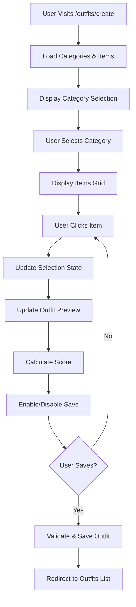
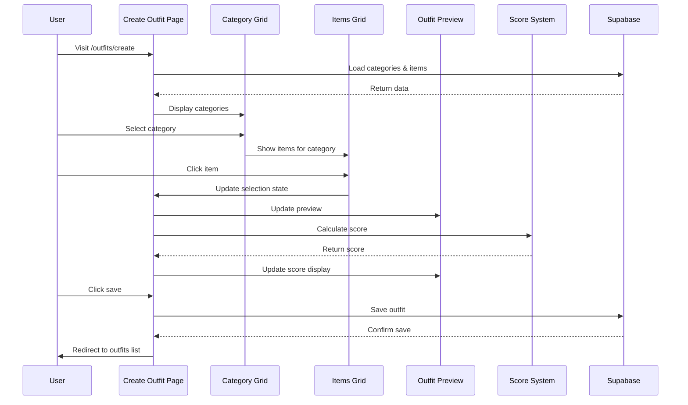

# Design Document

## Overview

The outfit creation selection fix addresses critical usability issues in the What to Wear application's outfit creation page. Currently, users can view wardrobe items but cannot properly select them to build and save outfits. This design provides a comprehensive solution that ensures intuitive item selection, real-time outfit preview, accurate scoring, and reliable persistence.

The solution focuses on fixing the broken selection mechanism while maintaining the existing architecture and improving the user experience through better state management, visual feedback, and error handling.

## Architecture

### High-Level System Flow



### Component Interaction Flow



## Components and Interfaces

### 1. Enhanced CreateOutfitPageClient Component

**Current Issues:**
- Complex category mapping logic that may fail
- Inconsistent state management between selection and tuck style
- Missing visual feedback for selections
- Inadequate error handling

**Proposed Fixes:**
```typescript
interface OutfitCreationState {
  selection: OutfitSelection;
  selectedCategory: string;
  outfitName: string;
  tuckStyle: 'Tucked' | 'Untucked';
  isLoved: boolean;
  isLoading: boolean;
  error: string | null;
  validationErrors: Record<string, string>;
}

interface CreateOutfitPageClientProps {
  // Enhanced error handling
  onError?: (error: Error) => void;
  onSuccess?: (outfit: Outfit) => void;
  // Enhanced navigation
  onCancel?: () => void;
  // Enhanced validation
  enableRealTimeValidation?: boolean;
}
```

**Key Improvements:**
- Simplified category-to-property mapping using a consistent lookup table
- Unified state management with Immer for immutable updates
- Real-time validation with immediate user feedback
- Comprehensive error handling with recovery options
- Optimistic UI updates for better perceived performance

### 2. Fixed ItemsGrid Component

**Current Issues:**
- Selection state not properly communicated to parent
- Missing visual indicators for selected items
- Inconsistent touch targets on mobile
- Performance issues with large item lists

**Enhanced Interface:**
```typescript
interface ItemsGridProps {
  category: string;
  items: WardrobeItem[];
  selectedItem?: WardrobeItem | null;
  onItemSelect: (item: WardrobeItem | null) => void; // null for deselection
  // Enhanced visual feedback
  selectionMode?: 'single' | 'toggle';
  showSelectionIndicator?: boolean;
  // Enhanced performance
  enableVirtualization?: boolean;
  // Enhanced accessibility
  announceSelections?: boolean;
}
```

**Key Improvements:**
- Clear selection/deselection logic with toggle support
- Prominent visual indicators for selected items
- Improved touch targets (minimum 44px) for mobile accessibility
- Virtual scrolling for large item collections
- ARIA announcements for screen reader users
- Keyboard navigation support

### 3. Enhanced OutfitPreview Component

**Current Issues:**
- Inconsistent preview updates
- Missing score breakdown information
- Poor empty state messaging
- Limited visual feedback

**Enhanced Interface:**
```typescript
interface OutfitPreviewProps {
  selection: OutfitSelection;
  score?: number;
  scoreBreakdown?: ScoreBreakdownData;
  // Enhanced visual feedback
  showAnimations?: boolean;
  highlightChanges?: boolean;
  // Enhanced functionality
  onItemRemove?: (category: string) => void;
  onTuckStyleChange?: (style: 'Tucked' | 'Untucked') => void;
  // Enhanced validation
  validationErrors?: Record<string, string>;
}
```

**Key Improvements:**
- Real-time preview updates with smooth animations
- Interactive score breakdown with detailed explanations
- Item removal capability directly from preview
- Clear validation error display
- Improved empty state with actionable guidance

### 4. Robust State Management System

**Current Issues:**
- State synchronization problems between components
- Lost selections during category navigation
- Inconsistent tuck style handling
- Missing error recovery

**Enhanced State Architecture:**
```typescript
interface OutfitCreationContext {
  // Core state
  state: OutfitCreationState;
  // Actions
  actions: {
    selectItem: (category: string, item: WardrobeItem | null) => void;
    setTuckStyle: (style: 'Tucked' | 'Untucked') => void;
    setOutfitName: (name: string) => void;
    toggleLoved: () => void;
    clearSelection: () => void;
    resetForm: () => void;
  };
  // Computed values
  computed: {
    isValid: boolean;
    canSave: boolean;
    selectedItemIds: string[];
    completionPercentage: number;
  };
  // Error handling
  error: {
    current: string | null;
    clear: () => void;
    retry: () => void;
  };
}
```

**Key Improvements:**
- Centralized state management with React Context
- Immutable state updates using Immer
- Computed values for derived state
- Comprehensive error handling with recovery actions
- State persistence during navigation

## Data Models

### Enhanced OutfitSelection Model

```typescript
interface OutfitSelection {
  // Core items
  jacket?: WardrobeItem;
  shirt?: WardrobeItem;
  undershirt?: WardrobeItem;
  pants?: WardrobeItem;
  shoes?: WardrobeItem;
  belt?: WardrobeItem;
  watch?: WardrobeItem;
  
  // Style preferences
  tuck_style: 'Tucked' | 'Untucked';
  
  // Computed values
  score?: number;
  scoreBreakdown?: ScoreBreakdownData;
  
  // Validation state
  isValid: boolean;
  validationErrors: Record<string, string>;
  
  // Metadata
  lastModified: Date;
  completionPercentage: number;
}
```

### Category Mapping Configuration

```typescript
interface CategoryMapping {
  [categoryName: string]: {
    selectionKey: keyof OutfitSelection;
    displayName: string;
    required: boolean;
    order: number;
    icon?: string;
  };
}

const CATEGORY_MAPPINGS: CategoryMapping = {
  'Jackets': { selectionKey: 'jacket', displayName: 'Jacket', required: false, order: 1 },
  'Shirts': { selectionKey: 'shirt', displayName: 'Shirt', required: true, order: 2 },
  'Undershirts': { selectionKey: 'undershirt', displayName: 'Undershirt', required: false, order: 3 },
  'Pants': { selectionKey: 'pants', displayName: 'Pants', required: true, order: 4 },
  'Shoes': { selectionKey: 'shoes', displayName: 'Shoes', required: true, order: 5 },
  'Belts': { selectionKey: 'belt', displayName: 'Belt', required: false, order: 6 },
  'Watches': { selectionKey: 'watch', displayName: 'Watch', required: false, order: 7 },
};
```

### Score Calculation Model

```typescript
interface ScoreBreakdownData {
  totalScore: number;
  maxScore: number;
  components: {
    formality: { score: number; weight: number; explanation: string };
    colorCoordination: { score: number; weight: number; explanation: string };
    styleConsistency: { score: number; weight: number; explanation: string };
    seasonalAppropriate: { score: number; weight: number; explanation: string };
    completeness: { score: number; weight: number; explanation: string };
  };
  recommendations: string[];
  warnings: string[];
}
```

## Error Handling

### Error Categories and Recovery Strategies

```typescript
enum ErrorCategory {
  NETWORK = 'network',
  VALIDATION = 'validation',
  AUTHENTICATION = 'authentication',
  DATA_INTEGRITY = 'data_integrity',
  USER_INPUT = 'user_input'
}

interface ErrorHandler {
  category: ErrorCategory;
  message: string;
  recoveryActions: RecoveryAction[];
  retryable: boolean;
  userFriendlyMessage: string;
}

interface RecoveryAction {
  label: string;
  action: () => void;
  primary?: boolean;
}
```

### Specific Error Scenarios

1. **Network Failures**
   - Retry with exponential backoff
   - Offline mode with local state preservation
   - Clear user messaging about connectivity issues

2. **Validation Errors**
   - Real-time field-level validation
   - Clear error messages with correction guidance
   - Prevention of invalid state transitions

3. **Data Inconsistencies**
   - Automatic data refresh and reconciliation
   - Conflict resolution with user choice
   - Fallback to last known good state

4. **Save Failures**
   - Preserve user work in local storage
   - Multiple retry attempts with different strategies
   - Manual save retry with error details

## Performance Optimizations

### Component-Level Optimizations

1. **Memoization Strategy**
   ```typescript
   // Memoize expensive computations
   const filteredItems = useMemo(() => 
     items.filter(item => item.category_id === selectedCategory),
     [items, selectedCategory]
   );
   
   // Memoize callback functions
   const handleItemSelect = useCallback((item: WardrobeItem) => {
     // Selection logic
   }, [selection, onSelectionChange]);
   ```

2. **Virtual Scrolling**
   - Implement virtual scrolling for large item lists (100+ items)
   - Lazy loading of item images
   - Progressive enhancement for better perceived performance

3. **State Update Batching**
   ```typescript
   // Batch multiple state updates
   const updateSelection = useCallback((updates: Partial<OutfitSelection>) => {
     startTransition(() => {
       setSelection(prev => ({ ...prev, ...updates }));
     });
   }, []);
   ```

### Data Loading Optimizations

1. **Parallel Data Fetching**
   ```typescript
   // Load categories and items in parallel
   const [categoriesQuery, itemsQuery] = useQueries({
     queries: [
       { queryKey: ['categories'], queryFn: fetchCategories },
       { queryKey: ['items'], queryFn: fetchItems }
     ]
   });
   ```

2. **Intelligent Caching**
   - Cache wardrobe items with 5-minute stale time
   - Cache categories with 10-minute stale time
   - Invalidate cache on mutations

3. **Optimistic Updates**
   - Immediate UI feedback for selections
   - Rollback on server errors
   - Conflict resolution for concurrent updates

## Correctness Properties

*A property is a characteristic or behavior that should hold true across all valid executions of a system-essentially, a formal statement about what the system should do. Properties serve as the bridge between human-readable specifications and machine-verifiable correctness guarantees.*

### Property 1: Category Item Display
*For any* category selection, clicking on a category button should display only items that belong to that specific category
**Validates: Requirements 1.1**

### Property 2: Item Selection State Update
*For any* wardrobe item, clicking on an item should add it to the selection state for the appropriate category
**Validates: Requirements 1.2**

### Property 3: Visual Selection Feedback
*For any* selected item, the UI should provide clear visual indicators (CSS classes, attributes) that distinguish it from unselected items
**Validates: Requirements 1.3, 5.1**

### Property 4: Category Selection Replacement
*For any* category with an existing selection, selecting a different item in the same category should replace the previous selection with the new item
**Validates: Requirements 1.4**

### Property 5: Item Deselection Toggle
*For any* currently selected item, clicking on it again should remove it from the selection state
**Validates: Requirements 1.5**

### Property 6: Selection State Persistence
*For any* outfit selection state, navigating between categories should preserve all existing selections without loss
**Validates: Requirements 1.6, 6.3**

### Property 7: Real-Time Preview Updates
*For any* item selection or deselection, the outfit preview should immediately reflect the change in the displayed items
**Validates: Requirements 2.1, 2.2, 2.3**

### Property 8: Preview Item Information Display
*For any* selected item with available data, the preview should display the item's name, brand (if available), and image (if available)
**Validates: Requirements 2.5**

### Property 9: Real-Time Score Calculation
*For any* outfit selection with items, the scoring system should calculate and display a compatibility score based on formality, style, and color coordination
**Validates: Requirements 2.6, 3.1, 3.2**

### Property 10: Score Breakdown Availability
*For any* calculated outfit score, the system should provide detailed breakdown information explaining the score components
**Validates: Requirements 3.4, 3.5**

### Property 11: Minimum Outfit Validation
*For any* outfit selection, the save functionality should only be enabled when at minimum a shirt/top and pants/bottom are selected
**Validates: Requirements 3.6, 4.1**

### Property 12: Outfit Persistence Integrity
*For any* valid outfit being saved, all selected items should be correctly persisted to the database and associated with the current user
**Validates: Requirements 4.2, 4.3**

### Property 13: Save Success Feedback
*For any* successfully saved outfit, the system should display a success message and redirect to the outfits collection
**Validates: Requirements 4.4**

### Property 14: Save Error Handling
*For any* failed save operation, the system should display clear error messages and provide retry functionality
**Validates: Requirements 4.5, 6.4**

### Property 15: Duplicate Outfit Prevention
*For any* outfit combination that already exists, the system should detect the duplicate and prevent saving while informing the user
**Validates: Requirements 4.6**

### Property 16: Keyboard Navigation Accessibility
*For any* interactive element on the outfit creation page, it should be reachable and operable via keyboard navigation
**Validates: Requirements 5.2**

### Property 17: Screen Reader Accessibility
*For any* selection change or important UI update, appropriate ARIA labels and announcements should be provided for screen readers
**Validates: Requirements 5.3**

### Property 18: Responsive Design Functionality
*For any* screen size (mobile, tablet, desktop), the category navigation and item selection should function correctly
**Validates: Requirements 5.4**

### Property 19: Loading and Error State Handling
*For any* data loading or error condition, the page should display appropriate UI states and handle errors gracefully without crashing
**Validates: Requirements 5.5, 5.6, 6.2**

### Property 20: Network Error Recovery
*For any* network error during operation, the current selection state should be maintained and retry options should be available
**Validates: Requirements 6.1**

### Property 21: Input Validation Before Save
*For any* save attempt, all user inputs should be validated before submission to prevent invalid data from reaching the database
**Validates: Requirements 6.5**

## Testing Strategy

### Unit Tests

Unit tests will focus on specific component behaviors and edge cases:

- **Selection Logic**: Test item selection, deselection, and replacement within categories
- **State Management**: Test state updates, persistence, and synchronization
- **Validation Logic**: Test outfit validation rules and error conditions
- **Score Calculation**: Test scoring algorithm with known input/output pairs
- **Error Handling**: Test error scenarios and recovery mechanisms

### Property-Based Tests

Each correctness property will be implemented as a property-based test with minimum 100 iterations:

- **Property 1-21**: Each property will be tested with randomly generated categories, items, and user interactions
- **Test Tags**: Each test will reference its corresponding property number and requirements
- **Data Generators**: Smart generators will create realistic wardrobe items, categories, and user interactions
- **Edge Case Coverage**: Generators will include edge cases like empty wardrobes, single-item categories, and network failures

### Integration Tests

Integration tests will validate end-to-end workflows:

- **Complete Outfit Creation Flow**: From category selection through item selection to successful save
- **Error Recovery Flows**: Network failures, validation errors, and save failures with recovery
- **Cross-Component Communication**: Verify proper data flow between components
- **Database Integration**: Test actual save/load operations with Supabase
- **Authentication Integration**: Test user-specific data isolation and permissions

### Manual Testing Scenarios

Critical user journeys that require manual validation:

1. **First-Time User Experience**: Empty wardrobe state and guidance
2. **Large Wardrobe Performance**: 100+ items per category performance testing
3. **Mobile Touch Interactions**: Touch targets and gesture support
4. **Accessibility Compliance**: Screen reader navigation and keyboard-only usage
5. **Cross-Browser Compatibility**: Chrome, Firefox, Safari, and Edge testing
6. **Network Conditions**: Slow connections, intermittent connectivity, and offline behavior

### Performance Testing

While not covered by correctness properties, performance testing will ensure:

- Selection interactions respond within 100ms
- Category switching completes within 200ms
- Preview updates occur within 50ms
- Score calculations complete within 300ms
- Large wardrobes (100+ items) perform without degradation
- Save operations complete within 2 seconds under normal conditions

## Implementation Notes

### Critical Bug Fixes Required

1. **Category Mapping**: Fix the category name to selection property mapping logic
2. **State Synchronization**: Ensure selection state stays in sync between components
3. **Visual Feedback**: Add clear selected/unselected visual indicators
4. **Error Boundaries**: Implement proper error handling to prevent crashes
5. **Save Validation**: Fix the minimum outfit validation before enabling save

### Backward Compatibility

- Maintain existing API contracts with Supabase Edge Functions
- Preserve existing URL structure and navigation patterns
- Ensure existing saved outfits continue to work correctly
- Maintain compatibility with existing wardrobe items and categories

### Security Considerations

- Validate all user inputs on both client and server side
- Ensure proper user authentication and data isolation
- Prevent SQL injection through parameterized queries
- Implement proper CORS and CSP headers
- Sanitize all user-generated content before display

This design provides a comprehensive solution to fix the outfit creation selection issues while maintaining the existing architecture and improving the overall user experience through better state management, visual feedback, and error handling.