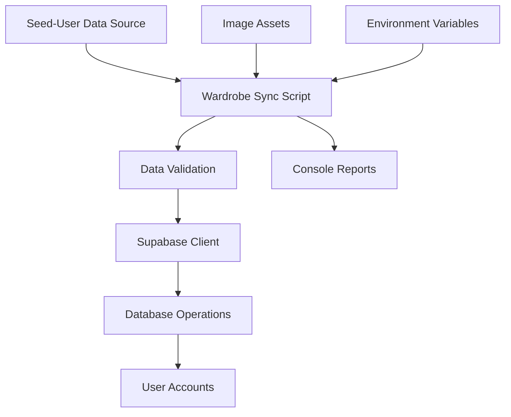
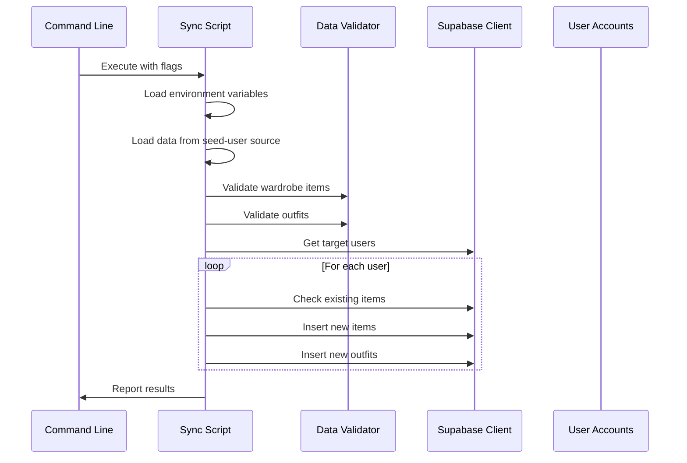

# Design Document

## Overview

The Wardrobe Sync Script is a Node.js command-line tool that uses the same data source as the seed-user Edge Function and synchronizes wardrobe items and outfits to the Supabase database. It provides a secure, controlled way for developers to add new clothing items and outfits to their own account or distribute them to all users.

The script follows the existing patterns established in the codebase, using the same wardrobeData and outfitData arrays as the seed-user Edge Function to maintain consistency and avoid data duplication.

## Architecture

### High-Level Flow



### Component Interaction



## Components and Interfaces

### 1. Main Script Module (`scripts/sync-wardrobe.js`)

**Responsibilities:**
- Command-line argument parsing
- Environment variable validation
- Orchestrating the sync process
- Progress reporting and error handling

**Interface:**
```javascript
// Command line usage
node scripts/sync-wardrobe.js [options]

// Options:
// --admin-only    Sync to admin user only (default)
// --all-users     Sync to all existing users
// --dry-run       Validate data without making changes
// --verbose       Enable detailed logging
```

### 2. Data Loader Module

**Responsibilities:**
- Loading data from seed-user source arrays
- Basic data structure validation
- Image asset verification

**Interface:**
```javascript
class DataLoader {
  loadWardrobeData(): WardrobeData
  loadOutfitData(): OutfitData
  validateImageAssets(items: WardrobeItem[]): ValidationResult
}
```

### 3. Data Validator Module

**Responsibilities:**
- Wardrobe item structure validation
- Outfit reference validation
- Color extraction and season mapping
- Duplicate detection logic

**Interface:**
```javascript
class DataValidator {
  validateWardrobeItem(item: WardrobeItem): ValidationResult
  validateOutfit(outfit: Outfit, wardrobeItems: WardrobeItem[]): ValidationResult
  extractColor(name: string): string | null
  mapSeason(capsuleTags: string[]): string[]
  checkDuplicates(items: WardrobeItem[], existingItems: WardrobeItem[]): DuplicateReport
}
```

### 4. Database Sync Module

**Responsibilities:**
- Supabase client initialization
- User account management
- Category mapping and creation
- Wardrobe item and outfit insertion
- Transaction management

**Interface:**
```javascript
class DatabaseSync {
  constructor(supabaseUrl: string, serviceRoleKey: string)
  getTargetUsers(adminOnly: boolean): Promise<User[]>
  getCategoriesForUser(userId: string): Promise<Category[]>
  insertWardrobeItems(userId: string, items: WardrobeItem[]): Promise<InsertResult>
  insertOutfits(userId: string, outfits: Outfit[]): Promise<InsertResult>
}
```

## Data Models

### Input Data Structures

```typescript
interface LocalWardrobeItem {
  id: string;
  name: string;
  category: string;
  brand?: string;
  capsuleTags?: string[];
  formalityScore?: number;
  image?: string;
}

interface LocalOutfit {
  id: string;
  items: string[];
  tuck?: string;
  weight?: number;
  loved?: boolean;
}

interface WardrobeData {
  items: LocalWardrobeItem[];
}

interface OutfitData {
  outfits: LocalOutfit[];
}
```

### Database Mapping

```typescript
interface DatabaseWardrobeItem {
  user_id: string;
  category_id: string;
  name: string;
  brand?: string;
  color?: string;
  formality_score?: number;
  capsule_tags?: string[];
  season?: string[];
  image_url?: string;
  active: boolean;
  external_id?: string; // Original ID from wardrobeData for duplicate tracking
}

interface DatabaseOutfit {
  user_id: string;
  name?: string;
  tuck_style?: 'Tucked' | 'Untucked';
  weight?: number;
  loved?: boolean;
  source: 'curated';
  score?: number;
  external_id?: string; // Original ID from outfitData for duplicate tracking
}
```

### Configuration

```typescript
interface SyncConfig {
  adminUserId?: string;
  imageBasePath: string;
  targetMode: 'admin-only' | 'all-users';
  dryRun: boolean;
  verbose: boolean;
}
```

## Error Handling

### Error Categories

1. **Configuration Errors**: Missing environment variables, invalid file paths
2. **Validation Errors**: Invalid data structure, missing references
3. **Database Errors**: Connection failures, constraint violations
4. **File System Errors**: Missing images, unreadable files

### Error Handling Strategy

```javascript
class SyncError extends Error {
  constructor(message, category, details = {}) {
    super(message);
    this.category = category;
    this.details = details;
  }
}

// Error handling patterns
try {
  await syncOperation();
} catch (error) {
  if (error instanceof SyncError) {
    logger.error(`${error.category}: ${error.message}`, error.details);
  } else {
    logger.error('Unexpected error:', error.message);
  }
  process.exit(1);
}
```

## Security Considerations

### Environment Variable Requirements

```bash
# Required for database access
SUPABASE_URL=https://your-project.supabase.co
SUPABASE_SERVICE_ROLE_KEY=your-service-role-key

# Optional: specify admin user
ADMIN_USER_ID=uuid-of-admin-user
# Or admin email for lookup
ADMIN_USER_EMAIL=admin@example.com
```

### Access Control

- Script requires service role key (not accessible to end users)
- All database operations respect Row Level Security (RLS)
- No sensitive data exposed in logs or error messages
- Input validation prevents injection attacks

### Data Isolation

- Each user's data remains isolated through RLS policies
- Category IDs are user-specific and properly mapped
- Outfit items only reference wardrobe items owned by the same user

## Correctness Properties

*A property is a characteristic or behavior that should hold true across all valid executions of a system-essentially, a formal statement about what the system should do. Properties serve as the bridge between human-readable specifications and machine-verifiable correctness guarantees.*

### Property 1: Data Structure Validation
*For any* wardrobe item or outfit data, the validation function should correctly identify valid structures and reject invalid ones based on required fields and data types
**Validates: Requirements 1.1, 6.4**

### Property 2: File System Validation  
*For any* image path referenced in wardrobe items, the validation should correctly identify existing files with supported extensions and handle missing or invalid files appropriately
**Validates: Requirements 1.2, 5.1, 5.4**

### Property 3: Reference Integrity
*For any* outfit data, all referenced wardrobe item IDs should exist in the provided wardrobe data, and invalid references should be properly identified
**Validates: Requirements 1.3**

### Property 4: Color Extraction Consistency
*For any* item name, the color extraction function should produce consistent results and handle edge cases (no color, multiple colors, special characters) appropriately
**Validates: Requirements 1.4**

### Property 5: Season Mapping Consistency  
*For any* set of capsule tags, the season mapping function should produce consistent and correct seasonal classifications
**Validates: Requirements 1.5**

### Property 6: Database Association Integrity
*For any* wardrobe item insertion, the item should be correctly associated with the specified user_id and appropriate category_id
**Validates: Requirements 2.4**

### Property 7: ID-Based Duplicate Detection Accuracy
*For any* combination of existing and new wardrobe items or outfits, the duplicate detection should correctly identify duplicates based on original IDs from the data arrays, with fallback to name/category matching for backward compatibility
**Validates: Requirements 4.1, 4.3, 4.6**

### Property 8: Image Path Formatting
*For any* processed wardrobe item with an image, the image_url should be formatted as a relative path starting with "/images/wardrobe/"
**Validates: Requirements 5.3**

### Property 9: Secure Logging
*For any* log message or error output, sensitive information (API keys, passwords, tokens) should never be exposed in the logged content
**Validates: Requirements 6.3, 7.4**

### Property 10: Summary Report Accuracy
*For any* sync operation, the summary report should accurately reflect the actual number of items added, skipped, and errors encountered for each user
**Validates: Requirements 4.3, 7.3**

## Testing Strategy

### Unit Tests

- Data validation functions with edge cases
- Color extraction and season mapping logic
- Duplicate detection algorithms
- File system validation utilities
- Error handling scenarios

### Property-Based Tests

- Each correctness property implemented as a property-based test
- Minimum 100 iterations per property test
- Random data generation for comprehensive input coverage
- Test tags referencing design document properties

### Integration Tests

- Database connection and authentication flows
- Full sync workflow with test data
- User targeting modes (admin-only vs all-users)
- Transaction rollback scenarios for failed operations
- End-to-end validation with actual image files

### Manual Testing

- Test with the actual image files from your list:
  - gilet-navy.png
  - loafers-black-penny.png  
  - loafers-tan-suede.png
  - quarterzip-black.png
  - quarterzip-gray.png
  - quarterzip-navy.png
  - quarterzip-tan.png
  - trench-coat-khaki.png
- Verify items appear correctly in the application UI
- Test both admin-only and all-users distribution modes
- Validate error handling with malformed JSON data