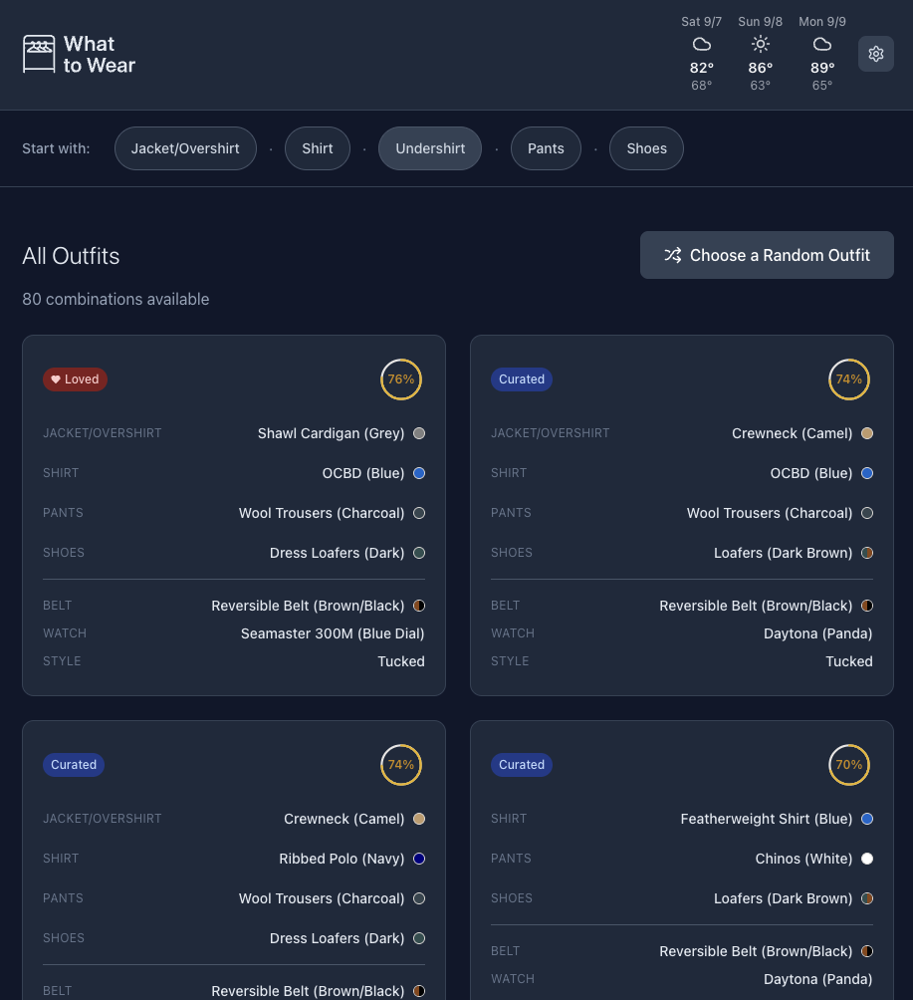

# My AI Outfit

A Next.js full-stack wardrobe management and outfit generation application that helps users create and discover clothing combinations from their personal wardrobe. The app features multi-user authentication, persistent data storage, custom image upload with background removal, and an intelligent outfit engine that generates combinations based on style compatibility, seasonal appropriateness, and user preferences, enhanced with real-time weather integration for location-based outfit recommendations.

## Features

- **Multi-User Authentication**: Secure user accounts with email/password and Google OAuth via Supabase Auth
- **Personal Wardrobe Management**: Private, user-specific wardrobe collections with database persistence and Row Level Security
- **Custom Image Upload**: Upload wardrobe item photos with automatic background removal processing using custom algorithms
- **Interactive Wardrobe Management**: Browse and select items from categorized clothing collections with 7-category layering system
- **Smart Outfit Generation**: AI-powered outfit recommendations based on style compatibility and layer-aware scoring
- **Real-Time Scoring**: Live outfit compatibility scoring with detailed breakdown popovers
- **Visual Outfit Display**: Flat and visual layout options showing proper layering and item details
- **Anchor-Based Discovery**: Find outfits that work well with a specific item as the foundation
- **Weather Integration**: 3-day weather forecast with location-based outfit suggestions (authenticated users only)
- **My Sizes System**: Pre-seeded clothing size categories with measurement guides for accurate size tracking across brands
- **Cross-Device Sync**: Access your wardrobe from any device with cloud-based data storage
- **Mobile-First Design**: Optimized responsive design for all device sizes with touch-friendly interactions
- **PWA Support**: Progressive Web App with offline capabilities and service worker
- **Data Security**: Complete data isolation between users with Supabase Row Level Security

## Screenshots
Outfit List             |  Visual Mockup
:-------------------------:|:-------------------------:
  |  

## My Sizes Feature

The My Sizes feature helps you track your clothing sizes across different categories and brands, making shopping easier and more accurate.

### System Categories

All users automatically receive 16 pre-seeded clothing categories:

**Men's Categories (8):**
- Dress Shirt (collar/sleeve measurements)
- Casual Shirt (letter/numeric sizes)
- Suit Jacket (chest size and length)
- Pants (waist/inseam)
- Jeans (waist/inseam)
- Shoes (US numeric sizes)
- Belt (waist size)
- Coat/Jacket (letter/numeric sizes)

**Women's Categories (8):**
- Dress (numeric/letter sizes with bust/waist/hip measurements)
- Blouse/Top (letter/numeric sizes)
- Pants (numeric or waist/inseam)
- Jeans (numeric or waist/inseam)
- Shoes (US numeric sizes)
- Jacket/Coat (letter/numeric sizes)
- Suit Jacket (numeric sizes)
- Belt (letter/numeric sizes)

### Measurement Guides

Each category includes detailed measurement guides with:
- **Step-by-step instructions** on how to measure correctly
- **Measurement fields** specific to each category (e.g., collar and sleeve for dress shirts)
- **Typical size ranges** to help validate your measurements
- **Size examples** showing common formats
- **Helpful tips** for accurate measuring

### Features

- **Auto-Seeding**: Categories are automatically created when you first access the My Sizes page
- **Standard Sizes**: Track your primary size for each category
- **Brand Sizes**: Record brand-specific sizes that differ from your standard size
- **Fit Scale**: Rate how brands fit (1-5: runs small to runs large)
- **Pinned Cards**: Pin frequently used categories to the top of your list
- **Display Modes**: Choose how to display sizes (standard, dual, or preferred brand)
- **Notes**: Add custom notes for each size entry
- **Gender-Specific**: Categories are tailored for men's and women's sizing conventions

### How to Use

1. **Navigate to My Sizes** from the main menu
2. **Categories auto-seed** on first visit (16 categories created automatically)
3. **Select a category** to view measurement guides and enter your sizes
4. **Add standard size** - your primary size for that category
5. **Add brand sizes** - record sizes for specific brands that differ
6. **Pin important categories** for quick access
7. **Customize display** - choose how you want sizes shown on pinned cards

### Database Schema

The My Sizes feature uses the following tables:
- `size_categories` - Category definitions with gender and measurement guides
- `standard_sizes` - User's primary size for each category
- `brand_sizes` - Brand-specific size overrides
- `category_measurements` - Body measurements for categories
- `pinned_preferences` - User's pinned category settings

All tables use Row Level Security (RLS) to ensure complete data privacy between users.

## Tech Stack

- **Frontend**: Next.js 15 with React 19.1.1 and TypeScript 5.5.3
- **Build Tool**: Next.js with Turbopack for fast development builds
- **Styling**: Tailwind CSS 4.1.13 with dark mode support
- **Icons**: Lucide React 0.544.0
- **Backend**: Supabase (PostgreSQL, Auth, Storage, Edge Functions)
- **State Management**: TanStack Query 5.90.3 for server state, Immer 10.1.3 for immutable updates
- **Validation**: Zod 4.1.12 for runtime type validation and schema definition
- **UI Components**: Radix UI primitives with custom styling
- **APIs**: OpenWeatherMap API (weather data), Google Maps Geocoding API
- **Deployment**: Netlify with serverless functions
- **PWA**: Service Worker for offline functionality
- **Testing**: Vitest 3.2.4 with Testing Library and jsdom (maintained for compatibility)
- **Linting**: ESLint 9.9.1 with Next.js config and accessibility (jsx-a11y) plugin

## Project Structure

```
app/                    # Next.js App Router (pages and layouts)
├── api/               # API routes (Next.js API handlers)
├── auth/              # Authentication pages and callbacks
├── wardrobe/          # Wardrobe management pages
├── outfits/           # Outfit collection and detail pages
├── anchor/            # Anchor-based outfit browsing
├── settings/          # User settings and preferences
├── sizes/             # My Sizes feature pages
├── protected/         # Protected route layouts
├── globals.css        # Global styles
├── layout.tsx         # Root layout component
└── page.tsx           # Homepage

components/             # React components (UI layer)
├── __tests__/         # Component tests
├── ui/                # Reusable UI components (Radix-based)
├── error-boundaries/  # Error boundary components
├── tutorial/          # Tutorial and onboarding components
├── sizes/             # My Sizes feature components
│   ├── category-grid.tsx        # Category list display
│   ├── measurement-guide.tsx    # Measurement instructions
│   ├── pinned-card.tsx          # Pinned category cards
│   ├── error-display.tsx        # Error handling component
│   └── my-sizes-client.tsx      # Main sizes client component
├── auth-button.tsx    # Authentication button component
├── image-upload.tsx   # Custom image upload with background removal
├── items-grid.tsx     # Grid display for wardrobe items
├── outfit-display.tsx # Main outfit visualization
├── outfit-flat-layout.tsx # Flat layout for outfit details
├── outfit-visual-layout.tsx # Visual outfit representation
├── score-breakdown.tsx # Score breakdown with popover
├── score-circle.tsx   # Score visualization component
├── selection-strip.tsx # Selected items display (mobile-optimized)
├── top-bar.tsx        # Navigation with authentication
├── weather-widget.tsx # 3-day weather forecast display
└── ...                # Additional feature components

lib/                   # Shared utilities and business logic
├── hooks/             # Custom React hooks with TanStack Query
│   ├── use-auth.ts    # Supabase authentication hooks
│   ├── use-wardrobe-items.ts # Wardrobe CRUD operations
│   ├── use-outfits.ts # Outfit management hooks
│   ├── use-categories.ts # Category management
│   ├── use-size-categories.ts # Size category hooks
│   └── use-user-preferences.ts # User settings hooks
├── data/              # Static data and constants
│   └── measurement-guides.ts # Measurement guide definitions
├── supabase/          # Supabase client configuration
│   ├── client.ts      # Browser client
│   ├── server.ts      # Server-side client
│   └── middleware.ts  # Authentication middleware
├── providers/         # React context providers
├── utils/             # Pure utility functions
├── types/             # TypeScript type definitions
│   ├── database.ts    # Supabase generated types
│   └── sizes.ts       # My Sizes type definitions
├── schemas/           # Zod validation schemas
│   └── sizes.ts       # Size validation schemas
└── test/              # Test setup and utilities

supabase/              # Supabase backend configuration
├── functions/         # Edge Functions (Deno runtime)
│   ├── seed-user/     # User onboarding function
│   ├── score-outfit/  # Outfit scoring function
│   ├── process-image/ # Background removal function
│   └── ...            # Additional business logic functions
├── migrations/        # Database migrations
│   ├── 20260208_create_seed_function.sql # System categories seed
│   └── ...            # Other migrations
└── supabase/          # Supabase CLI configuration

netlify/
└── functions/         # Netlify Functions (weather APIs)
    ├── weather.ts     # Weather API proxy with rate limiting
    ├── package.json   # Function dependencies
    └── tsconfig.json  # TypeScript configuration
```

## Getting Started

### Prerequisites

- Node.js (version 20 or higher)
- npm or yarn package manager
- Supabase account and project setup
- OpenWeatherMap API key for weather integration (optional)

### Local Development Setup

1. **Clone the repository:**
```bash
git clone <repository-url>
cd my-ai-outfit
```

2. **Install dependencies:**
```bash
npm install
```

3. **Set up environment variables:**
```bash
# Copy the example environment file
cp .env.example .env.local

# Edit .env.local with your configuration:
# NEXT_PUBLIC_SUPABASE_URL=your_supabase_project_url
# NEXT_PUBLIC_SUPABASE_ANON_KEY=your_supabase_anon_key
# SUPABASE_SERVICE_ROLE_KEY=your_supabase_service_role_key
# OPENWEATHER_API_KEY=your_openweathermap_api_key_here (optional)
```

4. **Set up Supabase database:**
```bash
# Install Supabase CLI (if not already installed)
npm install -g supabase

# Initialize Supabase (if not already done)
supabase init

# Start local Supabase (optional for local development)
supabase start

# Apply database migrations
supabase db push
```

5. **Start the development server:**
```bash
# For Next.js development
npm run dev

# For full development with Netlify Functions (recommended for weather features)
npm run dev:netlify
```

The application will be available at:
- Next.js dev server: `http://localhost:3000`
- Netlify dev server: `http://localhost:8888`

### Available Scripts

- `npm run dev` - Start Next.js development server with Turbopack
- `npm run dev:netlify` - Start Netlify dev environment with functions
- `npm run build` - Build the Next.js application for production
- `npm run start` - Start production server
- `npm run generate:outfits` - Build outfits from wardrobe (legacy)
- `npm run lint` - Run ESLint for code quality checks
- `npm run lint:a11y` - Run accessibility-specific linting
- `npm test` - Run tests in watch mode
- `npm run test:run` - Run tests once
- `npm run test:coverage` - Run tests with coverage report
- `npm run test:a11y` - Run accessibility compliance tests
- `npm run test:keyboard` - Test keyboard navigation
- `npm run verify:build` - Build and test verification
- `npm run verify:local` - Test deployment locally
- `npm run verify:production` - Test production deployment

## Weather Integration

The app provides location-based weather forecasts using OpenWeatherMap API. Weather data is securely accessed through Netlify Functions, with location obtained directly from the browser's geolocation API.

### Weather Integration Setup

```bash
# Copy environment template and add your API keys
cp .env.example .env.local

# Add your OpenWeatherMap API key to .env.local
# OPENWEATHER_API_KEY=your_api_key_here

# Start development with weather functions
npm run dev:netlify
```

Get your free API key from [OpenWeatherMap](https://openweathermap.org/api) (1,000 calls/day free tier).

## Data Structure

### Database Schema (Supabase PostgreSQL)

#### Wardrobe Items
Each clothing item includes:
- **User Ownership**: Items are private to each user via Row Level Security
- **Category**: References to user-specific categories
- **Metadata**: Name, brand, color, material, formality score (1-10)
- **Capsule Tags**: Style classifications array
- **Season**: Seasonal appropriateness array
- **Image**: Custom uploaded photos with background removal
- **Active Status**: Soft delete capability

#### Categories
User-specific categories with:
- **Name**: Category display name
- **Anchor Item**: Flag for anchor-based outfit building
- **Display Order**: Custom ordering for UI
- **User Ownership**: Private to each user

#### Outfits
Complete outfit combinations with:
- **User Ownership**: Private outfit collections
- **Item References**: Links to wardrobe items via junction table
- **Scoring**: Calculated compatibility scores
- **Tuck Style**: Tucked/Untucked preferences
- **Source**: Curated vs generated outfits
- **Loved Status**: User favorites

#### User Preferences
Personalized settings including:
- **Theme**: Light/dark/system preference
- **Feature Toggles**: Brand display, weather integration
- **Default Settings**: Tuck style preferences
- **Cross-Device Sync**: Stored in database, not localStorage

### Authentication & Security

- **Multi-User Support**: Complete user isolation via Supabase Auth
- **Row Level Security**: Database-level access control
- **OAuth Integration**: Google OAuth and email/password authentication
- **Session Management**: Automatic token refresh and secure storage

### Weather Data

Weather integration provides:
- **Current Conditions**: Temperature, weather description, icon
- **3-Day Forecast**: High/low temperatures, conditions, precipitation chance
- **Location Data**: Coordinates from browser geolocation or address input
- **Authenticated Access**: Weather features only available to logged-in users

## Core Features

### 7-Category Layering System

The wardrobe uses a realistic layering hierarchy that matches how clothing is actually worn:

1. **Jacket/Overshirt** (outermost layer)
2. **Shirt** (middle layer)
3. **Undershirt** (base layer) - for t-shirts and base layers
4. **Pants** (lower body)
5. **Shoes** (footwear)
6. **Belt** (accessories)
7. **Watch** (accessories)

This structure allows for accurate outfit composition and reflects real-world dressing patterns.

### Layer-Aware Scoring Algorithm

The scoring system accounts for how clothing layers interact:

- **Visibility Weighting**: Items covered by other layers have reduced impact on formality scores
  - Undershirt covered by shirt: 30% weight
  - Shirt covered by jacket: 70% weight
  - Visible items: 100% weight
- **Transparent Scoring**: Score breakdown shows individual item contributions and applied weights
- **Layer Adjustments**: Clear indication of why certain items have reduced scoring impact

### Visual Outfit Display

Interactive flip cards provide visual outfit representations:

- **Proper Layering**: Visual stacking matches clothing hierarchy (jacket over shirt over undershirt)
- **Flip Animation**: Smooth transitions between text-based and visual outfit views
- **Responsive Design**: Visual layouts adapt to different screen sizes

### Brand Management System

Optional brand tracking for wardrobe organization:

- **Brand Field**: Optional brand information for each wardrobe item
- **Flexible Display**: Items work with or without brand information
- **Consistent Formatting**: "Brand Item (Color)" format when brands are shown
- **Settings Integration**: User can toggle brand display on/off globally

### User Settings

Customizable preferences for personalized experience:

- **Settings Page**: Dedicated interface for managing user preferences
- **Brand Display Toggle**: Show or hide brand information throughout the app
- **Persistent Storage**: Settings saved locally and persist across sessions
- **Immediate Updates**: Changes take effect instantly without page refresh

## Component Architecture

### Key Components

**App Component:**
- Displays all outfits by default on page load
- Integrated weather service initialization
- Manages global application state

**TopBar Component:**
- Integrated WeatherWidget for location-based weather display
- Responsive design for mobile devices
- Navigation and branding elements

**ItemsGrid Component:**
- Direct click interactions on item containers
- Hover states with pointer cursor for better UX
- Enhanced accessibility with proper ARIA labels

**WeatherWidget Component:**
- Displays 3-day weather forecast with high/low temperatures
- Shows weather icons, dates, and precipitation chances
- Comprehensive error handling with user-friendly messages
- Graceful degradation when weather data is unavailable
- Retry functionality for recoverable errors

**OutfitCard Component:**
- Flip card functionality with smooth CSS transitions
- Front face shows traditional text-based outfit information
- Back face displays visual outfit layout
- Interactive flip triggers and touch-friendly design
- Responsive sizing for different screen sizes

**SettingsPage Component:**
- Dedicated settings interface with feature toggles
- Brand display toggle with immediate effect
- Local storage persistence for user preferences
- Responsive design matching app aesthetic
- Navigation integration with main app flow

**OutfitLayout Component:**
- Visual outfit representation
- Proper layering hierarchy (jacket over shirt over undershirt)
- Color application from actual wardrobe item colors
- Graceful handling of missing items (skips empty layers)
- Responsive sizing and positioning

**ScoreBreakdown Component:**
- Displays individual component scores with applied weights
- Shows layer adjustment reasons (covered/visible/accessory)
- Visual indicators for weight impacts on final score
- Transparent scoring explanation for user understanding
- Responsive layout for mobile and desktop viewing

**SelectionStrip Component:**
- Mobile-first responsive design with horizontal scrolling
- Touch-friendly interactions with minimum 44px touch targets
- Optimized for iPhone and tablet viewports

### Mobile Responsiveness

The app follows a mobile-first approach:

- **Breakpoints**: Mobile (320px+), Tablet (768px+), Desktop (1024px+)
- **Touch Targets**: Minimum 44px for all interactive elements
- **Scrolling**: Horizontal scroll for SelectionStrip on mobile
- **Layout**: Responsive grid systems that adapt to screen size
- **Typography**: Scalable text sizes across devices

## Development

### Database Development

#### Adding New Items
1. Use the web interface to upload items with photos
2. Items are automatically processed with background removal
3. All data is stored in Supabase with user isolation
4. Categories are user-specific and customizable

#### Database Migrations
```bash
# Create new migration
supabase migration new migration_name

# Apply migrations locally
supabase db reset

# Apply to production
supabase db push --linked
```

#### Edge Functions Development
```bash
# Create new Edge Function
supabase functions new function-name

# Deploy Edge Function
supabase functions deploy function-name

# Test locally
supabase functions serve
```

### Wardrobe Data Sync Script

For developers who need to add new wardrobe items and outfits programmatically, use the Wardrobe Sync Script:

```bash
# Sync new items to admin user only (default, safest)
node scripts/sync-wardrobe.js

# Sync new items to all existing users
node scripts/sync-wardrobe.js --all-users

# Test sync without making database changes
node scripts/sync-wardrobe.js --dry-run --verbose
```

**Key Features:**
- Secure authentication using Supabase service role key
- Validates data structure and image file existence
- Prevents duplicate items and outfits
- Supports admin-only or all-users distribution
- Comprehensive error handling and progress reporting

**Requirements:**
- `SUPABASE_SERVICE_ROLE_KEY` environment variable
- Image files in `public/images/wardrobe/` directory
- Wardrobe and outfit data defined in the script (uses seed-user source)

For detailed usage instructions, see [scripts/README.md](scripts/README.md).

### Authentication Development

#### Testing Authentication Flows
```bash
# Test with different user accounts
# Use Supabase dashboard to manage test users
# Verify RLS policies are working correctly
```

### Legacy Data Migration

#### Converting Static Data (if needed)
1. Use the seed-user Edge Function for initial data population
2. Import existing JSON data through the web interface
3. Ensure proper user association and category mapping

### Adding Images to Your Wardrobe

#### Automatic Background Removal
1. Upload images directly through the web interface
2. Custom background removal processing happens automatically
3. Fallback to original image if processing fails
4. Images are stored securely in Supabase Storage

#### Manual Image Processing (if needed)
1. Use ChatGPT or another tool to generate wardrobe item images
2. Split the grid image using [PineTools](https://pinetools.com/split-image)
3. Use [Remove.bg](https://www.remove.bg/) for manual background removal
4. Use [TinyPNG](https://tinypng.com/) to compress images before upload
5. Upload through the web interface for automatic processing

### Weather Service Integration

The weather service (`lib/hooks/use-weather.ts`) provides:
- Location-based weather fetching via browser geolocation
- Integration with Netlify Functions for secure API access
- Caching and retry logic for improved reliability
- Error handling for various failure scenarios

### Testing

```bash
# Run all tests
npm test

# Run tests once
npm run test:run

# Test specific features
npm test -- --grep "weather"
npm test -- --grep "WeatherWidget"
npm test -- --grep "scoring"
npm test -- --grep "OutfitCard"
npm test -- --grep "SettingsPage"
```

### Customizing Styles

The app uses Tailwind CSS for styling. Key customization areas:
- Modify component classes for visual changes
- Extend `tailwind.config.ts` for custom breakpoints or utilities
- Update responsive design breakpoints in components
- Customize weather widget appearance and layout

## Building for Production

```bash
# Build the application
npm run build

# Preview the production build locally
npm run preview
```

This creates an optimized build in the `out/` directory with:
- Minified JavaScript and CSS
- Optimized assets and images
- Service worker for PWA functionality
- Netlify Functions compiled and ready for deployment

## Deployment

### Production Deployment

1. **Set up production Supabase project:**
   - Create new Supabase project for production
   - Apply database migrations: `supabase db push`
   - Configure Row Level Security policies
   - Deploy Edge Functions: `supabase functions deploy`

2. **Configure environment variables in your deployment platform:**
   ```bash
   NEXT_PUBLIC_SUPABASE_URL=your_production_supabase_url
   NEXT_PUBLIC_SUPABASE_ANON_KEY=your_production_anon_key
   OPENWEATHER_API_KEY=your_production_api_key
   NODE_ENV=production
   ```

3. **Deploy to Netlify/Vercel:**
   ```bash
   # Build for production
   npm run build
   
   # Deploy (platform-specific)
   netlify deploy --prod
   # or
   vercel --prod
   ```

4. **Verify deployment:**
   ```bash
   # Test production deployment
   npm run verify:production
   ```

## Troubleshooting

### Common Development Issues

**Functions Not Working Locally:**
```bash
npm run dev:netlify  # Use this instead of npm run dev for weather features
```

**Environment Variables:**
- Copy `.env.example` to `.env.local` and add your API keys
- Restart dev server after changing environment variables

**Build Failures:**
```bash
# Check Node.js version (should be 20+)
node --version

# Clear cache and rebuild
rm -rf .next node_modules
npm install && npm run build
```

**Weather API Issues:**
- Verify OpenWeatherMap API key is valid
- Check API usage limits (1,000 calls/day free tier)
- Ensure location permissions are granted in browser

## PWA Features

The application includes:
- Service worker for offline functionality
- Web app manifest for installation capability
- Responsive design optimized for mobile devices
- Caching strategies for improved performance


## Contributing

1. Fork the repository
2. Create a feature branch
3. Make your changes following the mobile-first approach
4. Run linting and ensure all tests pass
5. Submit a pull request with detailed description

For questions or issues, please check the troubleshooting section above or create an issue in the repository.